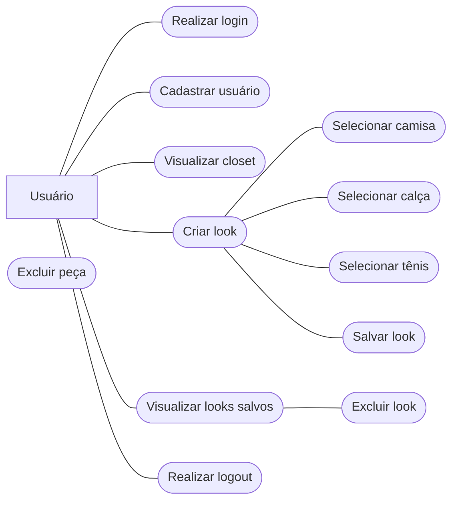

## Diagrama de Caso de Uso

## Descrição dos Casos de Uso

### Realizar login

Permite que o usuário acesse sua conta no sistema.

### Cadastrar usuário

Permite que um novo usuário crie uma conta no Apolo.

### Visualizar closet

Permite visualizar as peças cadastradas e os looks salvos pelo usuário.

### Gerenciar peças

Permite administrar as peças disponíveis no closet.

### Excluir peça

Permite remover uma peça cadastrada no closet.

### Criar look

Permite montar um novo look utilizando uma camisa, uma calça e um tênis.

### Selecionar camisa

Permite escolher a camisa que fará parte do look.

### Selecionar calça

Permite escolher a calça que fará parte do look.

### Selecionar tênis

Permite escolher o tênis que fará parte do look.

### Salvar look

Permite salvar o look criado para que ele possa ser visualizado posteriormente.

### Visualizar looks salvos

Permite visualizar os looks que foram criados e salvos anteriormente.

### Excluir look

Permite excluir um look salvo pelo usuário.

> **Observação:** após um look ser criado e salvo, o usuário não pode editá-lo nem adicionar ou remover peças. Caso queira fazer uma alteração, é necessário excluir o look e criar um novo.
